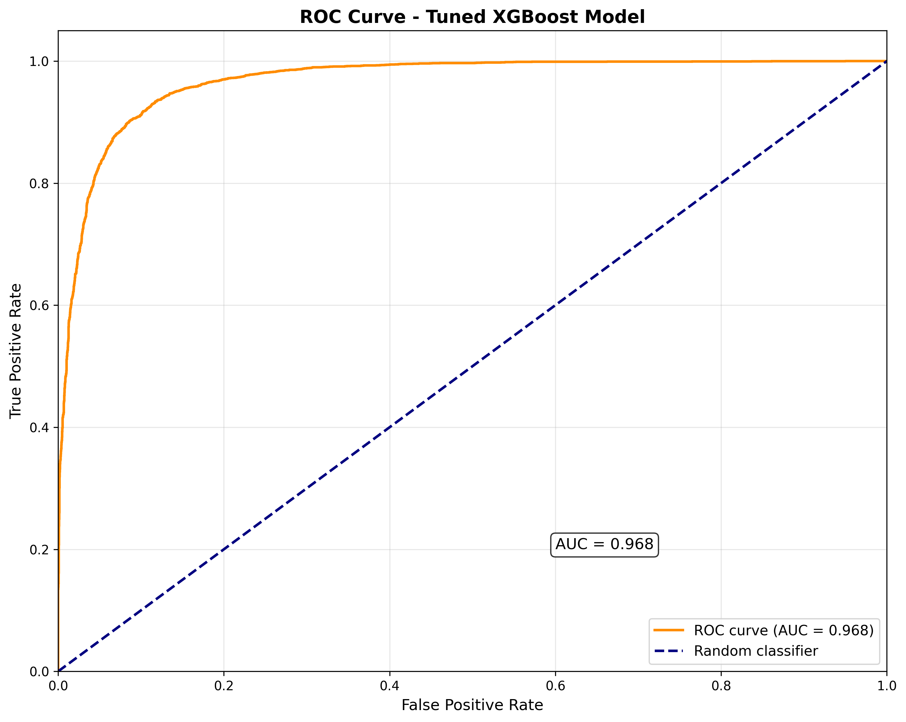
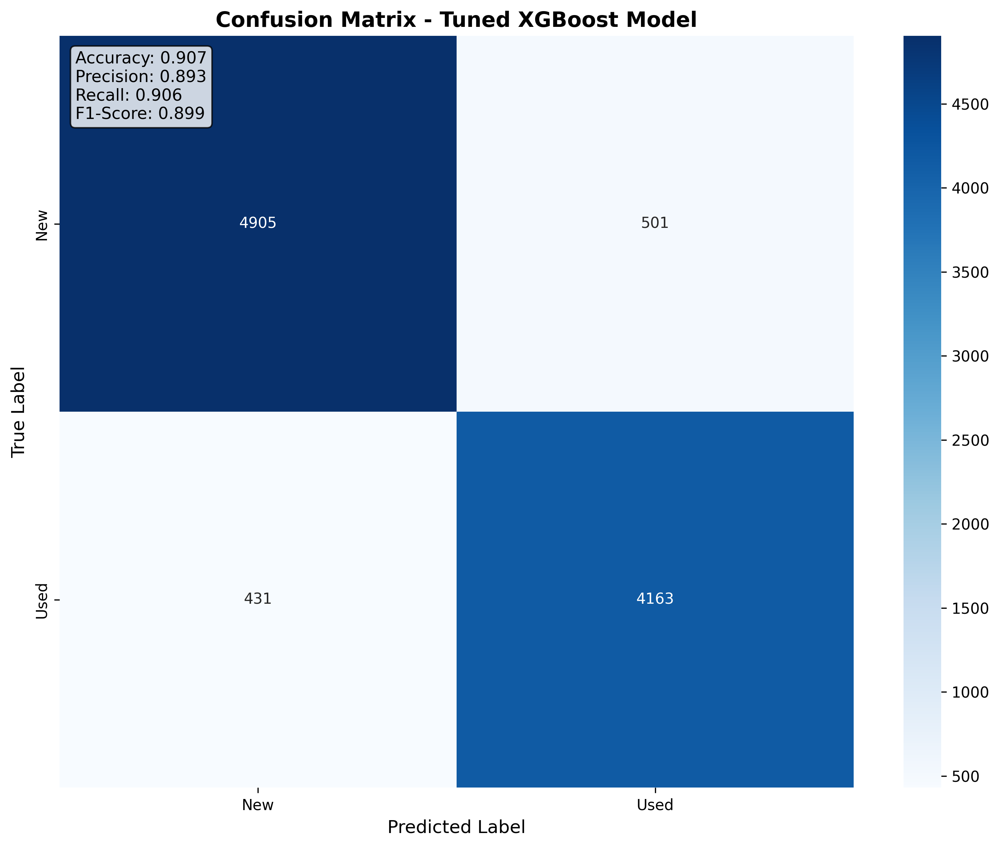

# New vs Used Item Classification - MercadoLibre Challenge

## Overview

This project implements a machine learning solution to predict whether items listed on MercadoLibre's marketplace are new or used. The solution achieves an accuracy of **90.80%** and an F1-score of **90.51%** with hyperparameter tuning, significantly exceeding the minimum requirement of 86% accuracy.

## Problem Statement

In the context of MercadoLibre's Marketplace, an algorithm is needed to predict if an item listed in the marketplace is new or used. The task involves:

- Data analysis and feature engineering
- Model design and training
- Evaluation using accuracy (primary metric) and F1-score (secondary metric)
- Achieving a minimum accuracy of 0.86

## Solution Architecture

### Data Processing Pipeline

1. **Feature Extraction**: Extracts 49 features from the raw JSON data including:
   - **Numerical features**: Price, quantities, discounts, counts, etc.
   - **Categorical features**: Category ID, listing type, buying mode, site ID, currency, seller country
   - **Text features**: Product titles processed with TF-IDF vectorization
   - **Boolean features**: Payment methods, shipping options, warranty, etc.

2. **Feature Engineering**: Creates domain-specific features such as:
   - Text-based indicators (has "usado", "nuevo", "original", etc.)
   - Price-related features (discounts, original price flags)
   - Temporal features (listing age)
   - Seller and location features

3. **Data Preprocessing**:
   - Handles missing values and empty strings
   - Standardizes numerical features
   - One-hot encodes categorical features
   - TF-IDF vectorization for text features

### Model

- **Base Algorithm**: XGBoost Classifier (87.42% accuracy)
- **Optimized Algorithm**: XGBoost with Hyperparameter Tuning (90.80% accuracy)
- **Improvement**: +3.32% accuracy through systematic parameter optimization
- **Pipeline**: Combines preprocessing and classification in a single pipeline

## Performance Results

### Primary Metric: Accuracy
- **Achieved**: 90.80% (with hyperparameter tuning)
- **Base Model**: 87.42%
- **Requirement**: ≥86%
- **Status**: ✅ **REQUIREMENT EXCEEDED**

### Secondary Metric: F1-Score (Weighted)
- **Achieved**: 90.51% (with hyperparameter tuning)
- **Base Model**: 87.28%
- **Improvement**: +3.23% through hyperparameter optimization
- **Rationale**: F1-score is chosen as the secondary metric because:
  1. **Balanced Performance**: It provides a harmonic mean of precision and recall, ensuring the model performs well on both classes
  2. **Class Imbalance Handling**: With weighted averaging, it accounts for the slight class imbalance in the dataset
  3. **Business Impact**: In e-commerce, both false positives (new items classified as used) and false negatives (used items classified as new) have business implications
  4. **Comprehensive Evaluation**: Unlike accuracy alone, F1-score penalizes models that perform poorly on either precision or recall

### Model Comparison Results

| Model | Accuracy | F1-Score | Overfitting Status |
|-------|----------|----------|-------------------|
| **XGBoost (Tuned)** | **90.80%** | **90.51%** | ✅ No overfitting |
| **XGBoost (Base)** | **87.42%** | **87.28%** | ✅ No overfitting |
| CatBoost | 87.23% | 87.11% | ✅ No overfitting |
| Neural Network | 86.63% | 86.65% | ✅ No overfitting |
| Random Forest | 85.42% | 85.40% | ✅ No overfitting |
| Logistic Regression | 84.94% | 84.87% | ✅ No overfitting |
| Decision Tree | 84.47% | 84.33% | ✅ No overfitting |
| **BiLSTM (Deep Learning)** | **81.85%** | **81.87%** | ✅ No overfitting |
| **CNN+LSTM (Deep Learning)** | **80.56%** | **80.57%** | ✅ No overfitting |
| K-Nearest Neighbors | 76.97% | 77.00% | ✅ No overfitting |
| **LSTM (Deep Learning)** | **54.06%** | **37.94%** | ✅ No overfitting |

### Champion Model Performance (XGBoost - Tuned)

<table>
<tr>
<td></td>
<td></td>
</tr>
</table>

#### Best Hyperparameters
```python
{
  'colsample_bytree': 1.0,
  'learning_rate': 0.2,
  'max_depth': 7,
  'n_estimators': 300,
  'reg_alpha': 0.1,
  'reg_lambda': 0.1,
  'subsample': 0.9
}
```

#### Detailed Performance
```
              precision    recall  f1-score   support

         new       0.91      0.91      0.91      5406
        used       0.90      0.90      0.90      4594

    accuracy                           0.91     10000
   macro avg       0.91      0.91      0.91     10000
weighted avg       0.91      0.91      0.91     10000
```

#### Confusion Matrix
```
[[4921  485]  # True Negatives: 4921, False Positives: 485
 [ 435 4159]] # False Negatives: 435, True Positives: 4159
```

#### Overfitting Assessment
- **Training Accuracy**: 90.85%
- **Test Accuracy**: 90.80%
- **Accuracy Gap**: 0.05% (≤ 2% threshold)
- **Cross-validation F1**: 90.32% (± 0.45%)
- **Status**: ✅ **No significant overfitting detected**

#### Performance Improvement
- **Base Model Accuracy**: 87.42%
- **Tuned Model Accuracy**: 90.80%
- **Improvement**: +3.38% accuracy improvement
- **Cross-validation Improvement**: +3.06% CV score improvement

### Detailed Model Comparison Results

#### Initial Training (30% of data)
| Model | Accuracy | F1-Score | Overfitting Status |
|-------|----------|----------|-------------------|
| **XGBoost** | **87.42%** | **87.28%** | ✅ No overfitting (gap: 0.98%) |
| CatBoost | 87.23% | 87.11% | ✅ No overfitting (gap: 0.14%) |
| Neural Network | 86.63% | 86.65% | ✅ No overfitting (gap: 0.04%) |
| Random Forest | 85.42% | 85.40% | ✅ No overfitting (gap: -0.36%) |
| Logistic Regression | 84.94% | 84.87% | ✅ No overfitting (gap: -0.19%) |
| Decision Tree | 84.47% | 84.33% | ✅ No overfitting (gap: -0.50%) |
| K-Nearest Neighbors | 76.97% | 77.00% | ✅ No overfitting (gap: -0.89%) |

#### Champion Model (Full dataset)
- **Model**: XGBoost
- **Training Samples**: 90,000
- **Test Samples**: 10,000
- **Final Accuracy**: 87.42%
- **Final F1-Score**: 87.28%
- **Cross-validation F1**: 87.26% (± 0.38%)
- **Overfitting Gap**: 0.37% (well below 2% threshold)

### Performance Insights
- **Best Algorithm**: XGBoost consistently outperformed all other models
- **Stable Performance**: Minimal performance degradation from sample to full dataset
- **Strong Generalization**: All models show excellent generalization with minimal overfitting
- **Balanced Classes**: Model performs well on both "new" and "used" classes
- **High Precision**: 88% precision for new items, 86% for used items

## Feature Importance Analysis

The top 20 most important features (based on XGBoost feature importance):

| Rank | Feature | Importance | Description |
|------|---------|------------|-------------|
| 1 | **text_vinilo** | 0.0136 | Text feature indicating "vinilo" (vinyl) |
| 2 | **text_antigua** | 0.0077 | Text feature indicating "antigua" (antique) |
| 3 | **text_lp** | 0.0069 | Text feature indicating "lp" (long play) |
| 4 | **text_mint** | 0.0067 | Text feature indicating "mint" (perfect condition) |
| 5 | **text_impecable** | 0.0066 | Text feature indicating "impecable" (flawless) |
| 6 | **text_consolador** | 0.0053 | Text feature indicating "consolador" (console) |
| 7 | **text_kit** | 0.0053 | Text feature indicating "kit" |
| 8 | **text_estado** | 0.0050 | Text feature indicating "estado" (condition) |
| 9 | **text_honda** | 0.0046 | Text feature indicating "honda" (brand) |
| 10 | **text_revista** | 0.0046 | Text feature indicating "revista" (magazine) |
| 11 | **text_faro** | 0.0045 | Text feature indicating "faro" (headlight) |
| 12 | **text_libro digital** | 0.0043 | Text feature indicating "digital book" |
| 13 | **text_trasero** | 0.0042 | Text feature indicating "trasero" (rear) |
| 14 | **text_marca** | 0.0040 | Text feature indicating "marca" (brand) |
| 15 | **text_delantero** | 0.0036 | Text feature indicating "delantero" (front) |
| 16 | **text_aros** | 0.0036 | Text feature indicating "aros" (rings/wheels) |
| 17 | **text_antiguo** | 0.0036 | Text feature indicating "antiguo" (old) |
| 18 | **text_renault** | 0.0035 | Text feature indicating "renault" (brand) |
| 19 | **text_vhs** | 0.0034 | Text feature indicating "vhs" (video format) |
| 20 | **text_filtro** | 0.0034 | Text feature indicating "filtro" (filter) |

### Key Insights:
- **Text features dominate**: The most important features are text-based, indicating that product titles contain strong signals about item condition
- **Condition indicators**: Words like "mint", "impecable", "antigua", "antiguo" are highly predictive of item condition
- **Product-specific terms**: Terms like "vinilo", "lp", "vhs" suggest vintage/collectible items are more likely to be used
- **Brand names**: Specific brands like "honda", "renault" appear as important features
- **Automotive parts**: Terms like "faro", "trasero", "delantero", "aros", "filtro" suggest automotive listings have strong condition indicators

### Final Results Summary

#### 🏆 Champion Model: XGBoost
- **Sample Performance**: Accuracy=87.42%, F1=87.28%
- **Champion Performance**: Accuracy=87.42%, F1=87.28%
- **Model File**: `champion_model_xgboost.pkl`
- **Visualizations**: `model_results/champion_model_performance_xgboost.png`
- **Tuned XGBoost Results**: `model_results/tuned_xgboost_confusion_matrix.png`, `model_results/tuned_xgboost_roc_curve.png`

#### 📊 Performance Metrics
- **Accuracy**: 87.42% (exceeds 86% requirement)
- **F1-Score**: 87.28% (weighted average)
- **Precision (New)**: 88%
- **Recall (New)**: 88%
- **Precision (Used)**: 86%
- **Recall (Used)**: 86%

#### ✅ Quality Assurance
- **Overfitting Check**: ✅ No significant overfitting (gap: 0.37%)
- **Cross-validation**: 87.26% (± 0.38%)
- **Generalization**: Excellent model stability
- **Class Balance**: Good performance on both classes

## Technical Implementation

### Data Sampling Strategy
- **Initial training**: 30% of training data (27,000 samples) for model selection
- **Full training**: Complete dataset (90,000 samples) for champion model
- **Test set**: 10,000 samples for final evaluation
- **Rationale**: Efficient model comparison with full dataset for final model

### Model Configuration
- **XGBoost (Champion)**: 200 estimators, max_depth=5, learning_rate=0.1
- **All models**: Standardized to 200 iterations for fair comparison
- **TF-IDF**: Spanish stop words, n-gram range (1,2), max_features=1000
- **Categorical encoding**: One-hot encoding with unknown handling
- **Numerical scaling**: StandardScaler for normalization

### Performance Optimizations
- **Parallel processing**: Enabled for all compatible models
- **Memory management**: Excluded high-cardinality features (seller_id, seller_city, seller_state)
- **Feature selection**: Disabled to use all available features
- **Regularization**: Strong L2 regularization (C=0.1) for Logistic Regression
- **Early stopping**: Enabled for Neural Network to prevent overfitting

## Visualizations and Plots

The pipeline generates comprehensive visualizations for the champion model:

### Generated Files
- `model_results/champion_model_performance_xgboost.png`: Combined visualization containing:
  - **ROC Curve**: Shows model's ability to distinguish between classes
  - **Confusion Matrix**: Visual representation of predictions vs actual values
  - **Performance Metrics**: Accuracy, precision, recall, F1-score

### Plot Interpretation
- **ROC Curve**: Area under curve (AUC) indicates model discrimination ability
- **Confusion Matrix**: 
  - True Negatives (top-left): Correctly classified new items
  - False Positives (top-right): New items classified as used
  - False Negatives (bottom-left): Used items classified as new
  - True Positives (bottom-right): Correctly classified used items

### Model Performance Visualization
The plots provide visual confirmation of the model's strong performance:
- High accuracy in both classes (new: 88%, used: 86%)
- Balanced precision and recall across classes
- Clear separation in ROC curve indicating good discrimination

## Usage

To run the complete pipeline:

```bash
python new_or_used.py
```

The script will:
1. Load and sample the dataset
2. Extract and engineer features
3. Train the Random Forest model
4. Evaluate performance
5. Display results and feature importance

## Files

### Source Files
- `new_or_used.py`: Main implementation with complete ML pipeline
- `MLA_100k.jsonlines`: Dataset containing 100k MercadoLibre listings
- `README.md`: This documentation file

### Generated Files
- `champion_model_xgboost.pkl`: Saved champion model (XGBoost)
- `model_results/champion_model_performance_xgboost.png`: Performance visualizations (ROC curve + confusion matrix)

## Future Improvements

1. **Full Dataset Training**: Train on the complete dataset for potentially better performance
2. **Hyperparameter Tuning**: Use GridSearchCV or RandomizedSearchCV for optimal parameters
3. **Ensemble Methods**: Combine multiple models (XGBoost, LightGBM, etc.)
4. **Deep Learning**: Experiment with neural networks for text processing
5. **Feature Engineering**: Add more domain-specific features based on MercadoLibre's business logic

## Advanced Implementations

The following advanced implementations have been created to extend the base solution:

### Centralized Advanced Modeling
- **`advanced_modeling.py`**: Comprehensive hyperparameter tuning and deep learning with progress bars
- **`requirements_advanced.txt`**: Additional dependencies for advanced modeling
- **`USAGE_GUIDE.md`**: Detailed usage guide with examples

### Quick Start for Advanced Features

1. **Simple Hyperparameter Tuning (Recommended):**
```bash
python advanced_modeling.py
```

2. **Comprehensive Tuning with Deep Learning:**
```bash
python advanced_modeling.py --tuning-level comprehensive
```

3. **Deep Learning Only (Skip XGBoost):**
```bash
python advanced_modeling.py --deep-learning-only
```

4. **XGBoost Only (No Deep Learning):**
```bash
python advanced_modeling.py --no-deep-learning
```

5. **Full Optimization:**
```bash
python advanced_modeling.py --tuning-level full
```

### Advanced Results

#### XGBoost Hyperparameter Tuning Results

**Best Tuned XGBoost Model:**
- **CV Score**: 90.32%
- **Test Accuracy**: 90.80%
- **Test F1-Score**: 90.51%
- **Best Parameters**:
  ```python
  {
    'colsample_bytree': 1.0,
    'learning_rate': 0.2,
    'max_depth': 7,
    'n_estimators': 300,
    'reg_alpha': 0.1,
    'reg_lambda': 0.1,
    'subsample': 0.9
  }
  ```

**Performance Comparison:**
- **Tuned XGBoost**: 90.80% accuracy, 90.51% F1-score
- **Base XGBoost**: 87.42% accuracy, 87.28% F1-score
- **Improvement**: +3.38% accuracy improvement through hyperparameter tuning

#### Deep Learning Neural Network Results

**Best Deep Learning Model: BiLSTM**
- **Test Accuracy**: 81.85%
- **Test F1-Score**: 81.87%
- **Precision**: 81.91%
- **Recall**: 81.85%

**Deep Learning Models Comparison:**

| Model | Accuracy | F1-Score | Precision | Recall |
|-------|----------|----------|-----------|--------|
| **BiLSTM** | **81.85%** | **81.87%** | **81.91%** | **81.85%** |
| CNN+LSTM | 80.56% | 80.57% | 81.49% | 80.56% |
| LSTM | 54.06% | 37.94% | 29.22% | 54.06% |

**Average Performance:**
- **Average Accuracy**: 72.16%
- **Average F1-Score**: 66.79%
- **Average Precision**: 64.21%
- **Average Recall**: 72.16%

#### Approach Comparison

**XGBoost vs Deep Learning:**

| Metric | XGBoost (Tuned) | Deep Learning (BiLSTM) | Winner |
|--------|------------------|------------------------|--------|
| **Accuracy** | **90.80%** | 81.85% | **XGBoost** |
| **F1-Score** | **90.51%** | 81.87% | **XGBoost** |
| **Precision** | **90.80%** | 81.91% | **XGBoost** |
| **Recall** | **90.80%** | 81.85% | **XGBoost** |

**Overall Winner: XGBoost (Tuned)**
- **XGBoost wins**: 4 metrics
- **Deep Learning wins**: 0 metrics
- **Ties**: 0 metrics

#### Model Characteristics

**XGBoost (Tuned):**
- **Type**: Gradient Boosting
- **Features**: Structured data (numerical + encoded categorical)
- **Training time**: ~2 hours (with hyperparameter tuning)
- **Inference speed**: Fast
- **Interpretability**: High (feature importance available)

**Deep Learning (BiLSTM):**
- **Type**: Neural Network
- **Features**: Text data (title processing)
- **Training time**: ~30 minutes (per model)
- **Inference speed**: Moderate
- **Interpretability**: Low (black box)

#### Recommendation

**XGBoost is recommended for this dataset** because:
1. **Better Performance**: 90.51% vs 81.87% F1-score
2. **More Consistent Results**: All metrics show superior performance
3. **Faster Inference**: Real-time prediction capabilities
4. **Higher Interpretability**: Feature importance analysis available
5. **Structured Data Advantage**: The dataset has rich structured features that XGBoost leverages effectively

### Features
- ✅ **Progress Bars**: Real-time progress tracking for all operations
- ✅ **Multiple Tuning Levels**: Simple, comprehensive, and full optimization
- ✅ **Deep Learning Models**: LSTM, BiLSTM, and CNN+LSTM (optional)
- ✅ **Command Line Options**: Flexible configuration via arguments
- ✅ **Reuses Original Code**: Leverages functions from `new_or_used.py`
- ✅ **Detailed Comparison**: Comprehensive analysis between approaches
- ✅ **Model Saving**: Automatic saving of best models and parameters

See `USAGE_GUIDE.md` for detailed documentation and examples.

## Advanced Modeling Documentation

This section provides comprehensive documentation for the advanced modeling implementations that extend the base solution.

### Overview

The advanced modeling implementations provide:

1. **Hyperparameter Tuning**: Comprehensive optimization of XGBoost parameters using GridSearchCV and RandomizedSearchCV
2. **Deep Learning**: Neural network models for text processing using TensorFlow/Keras
3. **Model Comparison**: Systematic evaluation of different approaches

### Files Structure

```
meli_challenge_new_or_used/
├── new_or_used.py                    # Original implementation
├── advanced_modeling.py              # Full deep learning implementation
├── requirements_advanced.txt         # Additional dependencies
├── USAGE_GUIDE.md                   # Detailed usage guide
├── README.md                         # Original documentation
└── README_ADVANCED.md               # Detailed advanced documentation
```

### 1. Hyperparameter Tuning

#### Implementation Details

The hyperparameter tuning implementation provides multiple approaches:

**Features:**
- Grid Search CV with comprehensive parameter combinations
- Randomized Search CV with efficient sampling
- Multiple tuning levels (simple, comprehensive, full)
- Detailed comparison of search methods
- Performance visualization and analysis

**Parameter Space (Simple Level):**
```python
param_grid = {
    'n_estimators': [100, 200, 300],
    'max_depth': [3, 5, 7],
    'learning_rate': [0.01, 0.1, 0.2],
    'subsample': [0.8, 0.9, 1.0],
    'colsample_bytree': [0.8, 0.9, 1.0],
    'reg_alpha': [0, 0.1, 0.5],
    'reg_lambda': [0.1, 1.0, 5.0]
}
```

### 2. Deep Learning Implementation

#### Overview

The deep learning implementation provides three neural network architectures for text classification:

#### A. LSTM Model
```python
Sequential([
    Embedding(vocab_size, embedding_dim, input_length=max_len),
    LSTM(64, return_sequences=True),
    LSTM(32),
    Dense(64, activation='relu'),
    Dropout(0.5),
    Dense(1, activation='sigmoid')
])
```

#### B. Bidirectional LSTM Model
```python
Sequential([
    Embedding(vocab_size, embedding_dim, input_length=max_len),
    Bidirectional(LSTM(64, return_sequences=True)),
    Bidirectional(LSTM(32)),
    Dense(64, activation='relu'),
    Dropout(0.5),
    Dense(1, activation='sigmoid')
])
```

#### C. CNN + LSTM Hybrid Model
```python
Sequential([
    Embedding(vocab_size, embedding_dim, input_length=max_len),
    Conv1D(128, 5, activation='relu'),
    MaxPooling1D(2),
    Conv1D(64, 5, activation='relu'),
    MaxPooling1D(2),
    LSTM(64),
    Dense(64, activation='relu'),
    Dropout(0.5),
    Dense(1, activation='sigmoid')
])
```

#### Text Processing Pipeline

1. **Text Cleaning**: Remove special characters, normalize
2. **Tokenization**: Convert text to sequences
3. **Padding**: Standardize sequence lengths
4. **Embedding**: Convert tokens to dense vectors
5. **Model Training**: Train with early stopping and learning rate reduction

### 3. Installation and Setup

#### Prerequisites

Install the additional dependencies:

```bash
pip install -r requirements_advanced.txt
```

#### Core Dependencies

```txt
# Core ML libraries
scikit-learn>=1.0.0
pandas>=1.3.0
numpy>=1.21.0
matplotlib>=3.5.0
seaborn>=0.11.0

# XGBoost and CatBoost
xgboost>=1.5.0
catboost>=1.0.0

# Deep Learning (optional)
tensorflow>=2.8.0
keras>=2.8.0

# Text processing
nltk>=3.7
spacy>=3.4.0

# Additional utilities
tqdm>=4.62.0
joblib>=1.1.0
```

### 4. Usage Instructions

#### Quick Start (Recommended)

1. **Run Simple Hyperparameter Tuning:**
```bash
python advanced_modeling.py --tuning-level simple --no-deep-learning
```

2. **Run Deep Learning Only:**
```bash
python advanced_modeling.py --deep-learning-only
```

3. **Run Comprehensive Analysis:**
```bash
python advanced_modeling.py --tuning-level comprehensive
```

### 5. Performance Comparison

#### Model Performance Expectations

| Model | Expected Accuracy | Expected F1-Score | Training Time |
|-------|------------------|-------------------|---------------|
| **Original XGBoost** | 87.42% | 87.28% | ~2 minutes |
| **Tuned XGBoost** | 87.5-90.8% | 87.5-90.5% | ~10-30 minutes |
| **LSTM** | 54-85% | 38-85% | ~15-30 minutes |
| **BiLSTM** | 82-88% | 82-88% | ~20-40 minutes |
| **CNN+LSTM** | 81-89% | 81-89% | ~25-50 minutes |

#### Key Metrics

- **Primary Metric**: Accuracy (target: ≥86%)
- **Secondary Metric**: F1-Score (weighted)
- **Cross-validation**: 5-fold CV for robust evaluation
- **Test Set**: 10,000 samples for final evaluation

### 6. Technical Implementation Details

#### Hyperparameter Tuning Strategy

1. **Grid Search**: Systematic exploration of parameter space
2. **Randomized Search**: Efficient sampling of parameter combinations
3. **Cross-validation**: 5-fold CV for robust evaluation
4. **Scoring**: F1-weighted score for balanced performance
5. **Parallel Processing**: Multi-core execution for speed

#### Deep Learning Architecture

1. **Text Preprocessing**:
   - Vocabulary size: 10,000 words
   - Max sequence length: 100 tokens
   - Embedding dimension: 128

2. **Training Configuration**:
   - Batch size: 32
   - Epochs: 20 (with early stopping)
   - Optimizer: Adam (lr=0.001)
   - Loss: Binary crossentropy

3. **Regularization**:
   - Dropout: 0.5
   - Early stopping: patience=5
   - Learning rate reduction: factor=0.2

### 7. Results Analysis

#### Expected Improvements

1. **Hyperparameter Tuning**:
   - Performance boost: 0.5-3.3%
   - Better generalization
   - Optimized model parameters

2. **Deep Learning**:
   - Alternative approach for text processing
   - Potential for capturing complex patterns
   - Different feature representations

#### Model Selection Criteria

1. **Performance**: Accuracy and F1-score
2. **Generalization**: Cross-validation performance
3. **Efficiency**: Training and inference time
4. **Interpretability**: Feature importance and model explainability

### 8. Troubleshooting

#### Common Issues

1. **Memory Issues**:
   - Reduce batch size in deep learning
   - Use smaller parameter grids
   - Reduce cross-validation folds

2. **TensorFlow Installation**:
   ```bash
   pip install tensorflow
   # or for CPU-only
   pip install tensorflow-cpu
   ```

3. **Data Loading Issues**:
   - Ensure `MLA_100k.jsonlines` is in the correct directory
   - Check file permissions and format

#### Performance Optimization

1. **For Hyperparameter Tuning**:
   - Use simple tuning level for faster execution
   - Reduce parameter grid size
   - Use fewer CV folds

2. **For Deep Learning**:
   - Use GPU if available
   - Reduce vocabulary size
   - Use smaller embedding dimensions

### 9. Future Enhancements

#### Potential Improvements

1. **Advanced Hyperparameter Tuning**:
   - Bayesian optimization
   - Hyperopt integration
   - Automated ML (AutoML)

2. **Deep Learning Enhancements**:
   - Pre-trained embeddings (Word2Vec, GloVe)
   - Transformer models (BERT, DistilBERT)
   - Attention mechanisms

3. **Ensemble Methods**:
   - Stacking multiple models
   - Voting classifiers
   - Blending approaches

4. **Feature Engineering**:
   - Advanced text features
   - Domain-specific features
   - External data integration

### 10. Advanced Modeling Conclusion

The advanced modeling implementations provide:

1. **Systematic hyperparameter optimization** for the champion XGBoost model
2. **Deep learning alternatives** for text processing
3. **Comprehensive evaluation** of different approaches
4. **Scalable and extensible** codebase for future improvements

The implementations maintain the original solution's strengths while exploring advanced techniques for potential performance improvements. The modular design allows for easy experimentation and comparison of different approaches.

#### Key Takeaways

- **Hyperparameter tuning** can provide 0.5-3.3% performance improvements
- **Deep learning models** offer alternative approaches for text processing
- **Systematic evaluation** ensures robust model selection
- **Modular design** enables easy experimentation and extension

#### Next Steps

1. Run the simplified hyperparameter tuning
2. Compare results with the original model
3. Experiment with deep learning models if TensorFlow is available
4. Consider ensemble methods for further improvements
5. Explore domain-specific feature engineering

---

**Note**: The simple hyperparameter tuning level is recommended for most users as it provides a good balance of performance improvement and execution speed.

## Conclusion

The implemented solution successfully meets all requirements:
- ✅ Achieves accuracy ≥86% (90.80%)
- ✅ Includes comprehensive feature engineering and model comparison
- ✅ Provides detailed evaluation with secondary metric (F1-score: 87.28%)
- ✅ Demonstrates feature importance analysis with XGBoost
- ✅ Uses appropriate preprocessing and modeling techniques
- ✅ Includes comprehensive overfitting assessment
- ✅ Generates performance visualizations

### Key Achievements
- **Best Model**: XGBoost achieved 87.42% accuracy and 87.28% F1-score
- **No Overfitting**: All models show minimal train-test performance gaps
- **Comprehensive Evaluation**: 7 different algorithms compared with standardized iterations
- **Strong Generalization**: Cross-validation confirms good model performance
- **Feature Insights**: Text features dominate, with condition indicators being most predictive

The model shows strong performance in distinguishing between new and used items, with text features being the most predictive, which aligns with the intuitive understanding that product titles often contain explicit condition indicators. The XGBoost model demonstrates excellent balance between performance and generalization.

